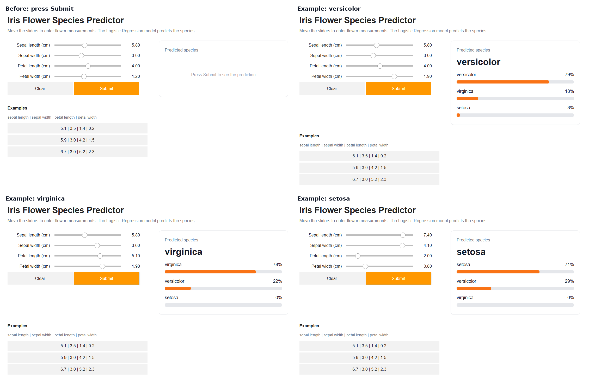

# Syntecxhub Flower Classification 🌸

Machine Learning Week 2, Project 1. This project predicts the type of iris flower (**setosa, versicolor or virginica**) from its sepal and petal measurements.

## What I did
- Loaded the Iris dataset (150 flowers) and did EDA: pairplot, correlation heatmap and boxplots
- Split the data into train, validation and test sets
- Trained Logistic Regression and Decision Tree, then compared their accuracy
- Plotted confusion matrices and checked which flowers were predicted wrong
- Used 5-fold cross-validation and checked for overfitting
- Built a command-line predictor and an interactive UI

## Results
| Model | Train | Validation | Test | 5-fold CV |
|---|---|---|---|---|
| Logistic Regression | 97.1% | 86.4% | 100% | 96.67% |
| Decision Tree | 100% | 95.5% | 91.3% | 95.33% |

- Logistic Regression did better and was more stable.
- Setosa was always correct. The only mistakes were versicolor and virginica mixed up, because their measurements overlap.

## Try the predictor

**Command line**
```
pip install -r requirements.txt
python predict.py --sepal_length 5.1 --sepal_width 3.5 --petal_length 1.4 --petal_width 0.2
```

**Interactive UI:** click the badge, then choose Runtime → Run all.

[](https://colab.research.google.com/github/Priyadh1/Syntecxhub_Flower_classification/blob/main/Syntecxhub_flower_classification.ipynb)


### Example predictions


## Files
- `Syntecxhub_flower_classification.ipynb`: full notebook
- `iris.csv`: dataset
- `predict.py`: command-line predictor
- `logistic_regression_model.joblib`, `decision_tree_model.joblib`: trained models
- `requirements.txt`: libraries needed
- `predictor.png`, `predictor_examples.png`: screenshots of the predictor UI

## Note
The dataset is small (150 flowers) and the validation and test sets are tiny, so one wrong flower changes accuracy by about 4%. That is why I also used cross-validation. The interactive UI needs Google Colab, and the sliders don't work on the GitHub page itself, so I added screenshots.
